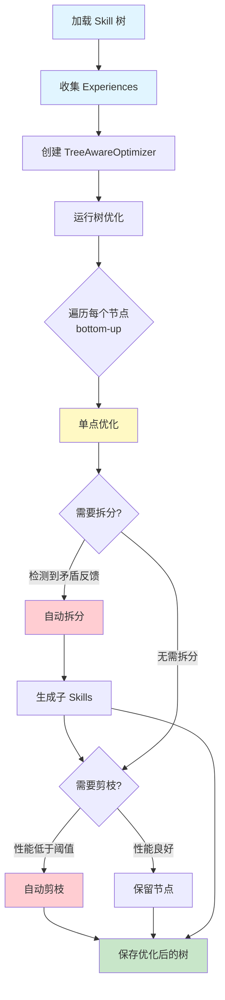
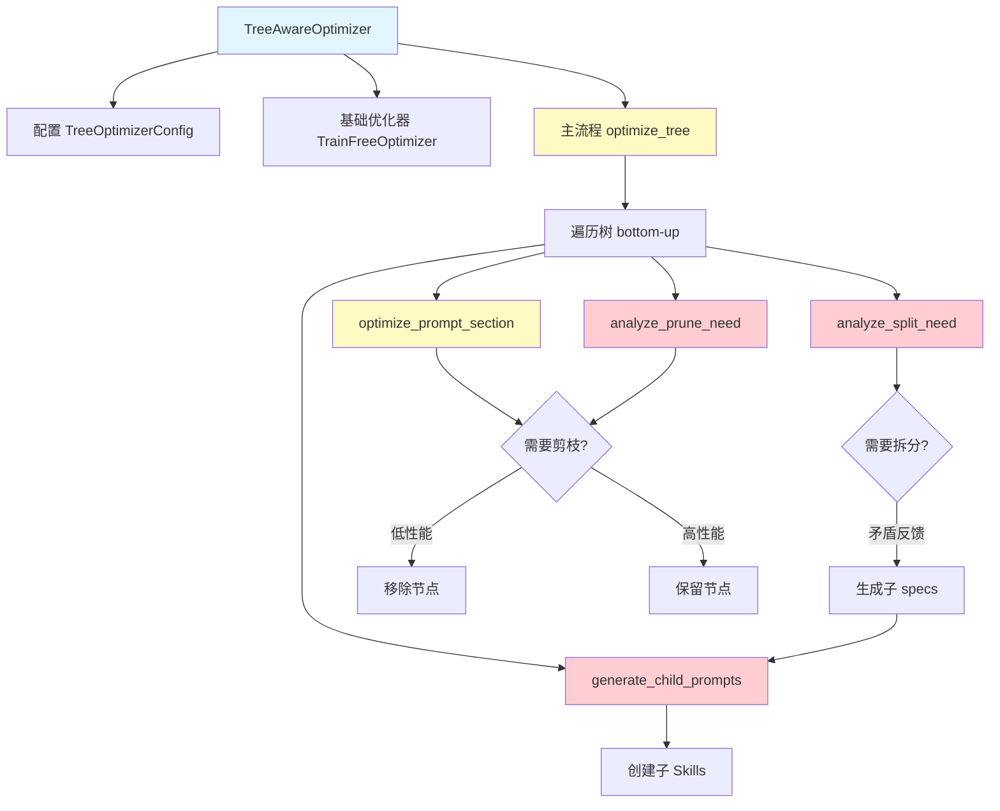
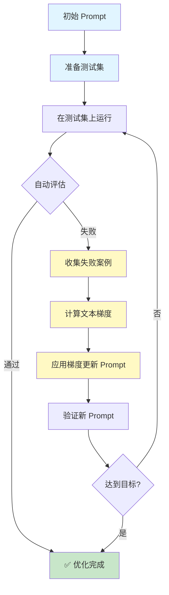

# 🧬 Evo-Framework

**多模态、自进化的 Agent Prompt 优化框架**

把 System Prompt 当作"权重"，把交互历史当作"数据集"，通过 **APO（自动提示优化）** 循环，让你的 Agent 越用越好。

---

## 核心理念

```
用户反馈 → 诊断失败原因 → 计算"文本梯度" → 重写 System Prompt → 更好的 Agent
```

不需要训练模型、不需要标注数据——只需要在日常对话中告诉 Agent 哪里做得不好，框架会自动把 prompt 进化到更好的版本。

## 安装

```bash
conda activate pr
cd /path/to/evo_agent
pip install -e .
```

## 快速开始

### 1. 配置

**方式 A：用 YAML 配置文件（推荐）**

```bash
# 复制模版并填入你的 API Key
cp demo/example/config.yaml my-config.yaml
# 编辑 my-config.yaml（所有字段都有中文注释）
```

**方式 B：用 .env 文件**

```env
EVO_LLM_API_KEY=your-api-key
EVO_LLM_BASE_URL=https://api.siliconflow.cn/v1
EVO_LLM_MODEL=Qwen/Qwen2.5-14B-Instruct
EVO_LLM_JUDGE_MODEL=Qwen/Qwen2.5-14B-Instruct
```

> 完整参数模版见 `demo/example/config.yaml`，完整 Skill 模版见 `demo/example/skill.yaml`

### 2. 启动聊天

```bash
# 用 config 文件 + skill 启动（推荐）
python -m evo_framework.main --config my-config.yaml --skill demo/writing-skills.yaml

# 用默认 skill（首次自动创建）
python -m evo_framework.main --skill default

# 用已有的 skill 文件（只用 .env 配置）
python -m evo_framework.main --skill demo/writing-skills.yaml

# 用 skill 树目录（层级技能包）
python -m evo_framework.main --skill demo/my-writing-tree/
```

### 3. 在聊天中优化

```
You: 帮我写一段关于春天的短文

🤖 Assistant: [生成结果]

You: /bad 太像AI写的，缺乏生活气息       ← 标记"不好" + 原因
You: /rewrite 春天来了，小区的玉兰花...    ← 提供理想回答
You: /target 更像人，有生活气息            ← 设置全局优化方向
You: /optimize                            ← 一键 APO 优化！

✓ Skill optimized → writing-assistant (v1.0 → v1.1) (checkpoint saved)
```

### 4. 运行 Demo（交互式）

```bash
python demo/demo_from_scratch.py    # 从零构建 skill 并进化
python demo/demo_from_skill.py      # 从已有 skill 开始优化
```

两个 demo 都是交互式的——你可以在每个步骤中修改输入、自定义反馈、设置优化方向。

## 完整示例

### 示例 1: 基础优化（交互式）

```bash
python example_optimizer.py
```

展示如何使用 TrainFreeOptimizer：
- 创建初始 Prompt
- 收集失败案例
- 计算文本梯度
- 应用梯度更新
- 验证优化结果

### 示例 2: 工具注册

```bash
python example_tools.py
```

展示如何注册和使用工具：
- Python 函数工具
- HTTP API 工具
- MCP 工具
- 工具组合

### 示例 3: 完全自动化优化

```bash
# 设置 API
export OPENAI_API_KEY="your-key"
export OPENAI_BASE_URL="https://api.siliconflow.cn/v1"

# 运行
python example_fully_automatic.py
```

展示如何实现完全自动化的优化：
- 自动生成测试集
- 自动评估结果
- 自动计算梯度
- 自动优化 Prompt
- **无需人工干预**

**适合生产环境的持续优化**。

**适合生产环境的持续优化**。

### 示例 5: 树感知优化（自动拆分 & 剪枝）

```bash
python example_tree_optimization.py
```

展示如何使用 TreeAwareOptimizer 进行树感知优化：
- **自动拆分**: 检测到矛盾反馈时自动拆分 skill 为子 skills
- **自动剪枝**: 根据性能指标自动移除低效子 skill
- **部分优化**: 支持只修改 prompt 的某一部分（指令、示例、约束）
- **树感知优化**: 递归优化整棵 skill 树（bottom-up）

**优化流程**:



**核心功能**:

1. **自动拆分分析**
   ```mermaid
   graph LR
       A[分析反馈] --> B{存在矛盾?}
       B -->|是| C[生成子规格]
       B -->|否| D[保持现状]
       C --> E[创建子 Skills]
   ```

2. **自动剪枝判断**
   ```mermaid
   graph TD
       A[收集性能指标] --> B{性能分数 < 阈值?}
       B -->|是| C[标记剪枝]
       B -->|否| D{使用频率极低?}
       D -->|是| C
       D -->|否| E{成功率 < 30%?}
       E -->|是| C
       E -->|否| F[保留节点]
   ```

3. **部分优化策略**
   - `all`: 完整优化（默认）
   - `instruction`: 只优化指令部分
   - `examples`: 只优化 few-shot examples
   - `constraints`: 只优化约束条件

**使用示例**:

```python
from evoskill import (
    SkillTree,
    OpenAIAdapter,
    TreeAwareOptimizer,
    TreeOptimizerConfig,
)

# 1. 创建组件
adapter = OpenAIAdapter(model="gpt-4o-mini")
config = TreeOptimizerConfig(
    auto_split=True,      # 启用自动拆分
    auto_prune=True,      # 启用自动剪枝
    prune_threshold=0.3,  # 剪枝阈值
    section="all",        # 优化整个 prompt
)
tree_optimizer = TreeAwareOptimizer(
    adapter=adapter,
    config=config,
)

# 2. 加载 skill 树
tree = SkillTree.load("my-skills/")

# 3. 收集 experiences
experiences = load_experiences("traces.jsonl")

# 4. 优化树
result = tree_optimizer.optimize_tree(tree, experiences)

# 5. 查看结果
print(f"✓ 优化了 {result.nodes_optimized} 个节点")
print(f"✓ 拆分了 {result.splits_performed} 次")
print(f"✓ 剪枝了 {result.prunes_performed} 个节点")

# 6. 保存
result.tree.save("my-skills-optimized/")
```

### 示例 4: 加载已存储的 Skill 和配置

**详细使用指南**: 请查看 [`USAGE_GUIDE.md`](./USAGE_GUIDE.md) 获取完整的配置和 Skill 管理说明。

```bash
python example_load_skill_and_config.py
```

展示如何：
- 加载配置文件（config.yaml）
- 加载已存储的 skill 文件
- 使用适配器调用 LLM
- 保存优化后的 skill
- 手动反馈 + 计算梯度
- 继续优化已存储的 skill

**配置优先级**: 环境变量 > .env 文件 > YAML 配置文件 > 默认值

### 5. 导入验证（不需要网络）

```bash
cd /path/to/evo_agent
python -c "
from evo_framework.schema import Skill, SkillMeta
from evo_framework.skill_tree import SkillTree, SkillNode
from evo_framework.checkpoint import CheckpointManager
from evo_framework.optimizer import APOEngine
from evo_framework import skill as skill_module
print('All imports OK')

# 测试 YAML 中文可读性
sk = Skill(name='test', system_prompt='你好世界')
skill_module.save(sk, '/tmp/test_skill.yaml')
print(open('/tmp/test_skill.yaml').read())
"
```

## 命令一览

| 命令 | 作用 |
|------|------|
| `/bad <原因>` | 标记上一条回复为"不好"，附上原因 |
| `/rewrite <文本>` | 标记上一条回复并提供理想答案 |
| `/target <方向>` | 设置全局优化方向（如"更像人"、"更简洁"） |
| `/image <路径>` | 附加本地图片到下一条消息（支持多模态） |
| `/optimize` | 触发 APO 优化循环 + 自动保存 checkpoint |
| `/save` | 强制保存当前 skill |
| `/tree` | 显示技能树层级结构 |
| `/select <路径>` | 切换活动技能（如 `/select social.moments`） |
| `/split` | 分析当前技能是否需要拆分为子技能 |
| `/ckpt` | 列出所有可用 checkpoint |
| `/restore <名称>` | 从 checkpoint 恢复 |
| `/quit` | 退出 |

## 层级 Skill 树

Skill 可以用**文件夹结构**组织成树形层级：

```
my-writing-tree/
├── _meta.yaml          # 包级元信息
├── root.yaml           # 根技能（通用写作 prompt）
├── social/
│   ├── _meta.yaml
│   ├── root.yaml       # 社交类子技能
│   ├── moments.yaml    # 朋友圈
│   └── weibo.yaml      # 微博
└── business/
    ├── root.yaml       # 商务类子技能
    ├── email.yaml
    └── product.yaml
```

**创建 Skill 树示例：**

```bash
# 创建目录结构
mkdir -p my-skills/social my-skills/business

# 在 root.yaml 中写你的根技能
cat > my-skills/root.yaml << 'EOF'
name: writing-assistant
system_prompt: 你是一位专业的中文写作助手。
EOF

# 启动
python -m evo_framework.main --skill my-skills/
```

**自动拆分**：优化时如果反馈覆盖多个不同领域，框架会自动建议拆分成子技能（`/split` 命令或 `--optimize` 时自动触发）。

## Checkpoint 系统

每次 `/optimize` 后会自动保存 checkpoint 到 `ckpt/` 目录：

```
ckpt/
└── writing-assistant_v1.2_20260306_140000/
    ├── skill/          # 完整的 skill 文件（或 skill 树）
    │   └── root.yaml
    └── mem/
        ├── traces.jsonl     # 交互历史
        └── meta.json        # 元数据（版本、时间等）
```

**从 checkpoint 恢复：**

```bash
# CLI 中恢复
/ckpt                                    # 列出所有 checkpoint
/restore writing-assistant_v1.2_20260306_140000  # 恢复

# 命令行直接恢复
python -m evo_framework.main --ckpt ckpt/writing-assistant_v1.2_20260306_140000
```

## 项目结构

### v0.2.0 架构 (evoskill)

```
evoskill/                    # 核心模块
├── core/                   # 核心抽象层
│   ├── abc.py             # 抽象基类 (Prompt, Gradient, Experience)
│   ├── prompts.py         # Prompt 实现 (Text, Multimodal, Structured)
│   ├── gradient.py        # 梯度实现 (Simple, Multimodal, History)
│   ├── experience.py      # 经验和反馈 (Conversation, Multimodal)
│   ├── base_adapter.py    # 适配器基类 (compute_gradient, apply_gradient)
│   ├── optimizer.py       # TrainFreeOptimizer (TGD 核心算法)
│   ├── tree_optimizer.py  # TreeAwareOptimizer (树感知优化) ⭐ NEW
│   ├── strategies.py      # 优化策略 (保守/激进/自适应)
│   └── validators.py      # 验证器 (Auto, Metric, Composite)
│
├── adapters/              # 模型适配器
│   ├── openai.py         # OpenAI 适配器 (GPT-4o, o1)
│   └── anthropic.py      # Anthropic 适配器 (Claude 3.5)
│
├── registry.py           # 插件注册系统 (@adapter, @optimizer, @hook)
├── tools.py              # 工具注册系统 (@tool, HTTP, MCP)
│
└── [legacy]              # 向后兼容 (v0.1)
    ├── schema.py, skill.py, skill_tree.py
    ├── checkpoint.py, storage.py
    └── optimizer.py (APOEngine)
```

### 核心组件职责

| 组件 | 职责 | 文件路径 |
|------|------|---------|
| **核心抽象** | 定义统一接口 | `evoskill/core/abc.py` |
| **优化引擎** | TGD 优化算法 | `evoskill/core/optimizer.py` |
| **树优化器** | 树感知优化（拆分/剪枝）| `evoskill/core/tree_optimizer.py` ⭐ NEW |
| **模型适配器** | 连接不同 LLM | `evoskill/adapters/` |
| **插件系统** | 注册自定义组件 | `evoskill/registry.py` |
| **工具系统** | 注册第三方工具 | `evoskill/tools.py` |

### 树感知优化架构



### 向后兼容

v0.1 的 `evo_framework/` 包仍然可用，会自动重导出 `evoskill`（显示 DeprecationWarning）。

## APO 优化原理

evoskill 支持两种优化模式：**交互式优化**（人工提供反馈）和**完全自动化优化**（无需人工干预）。

### 两种优化模式对比

| 模式 | 反馈来源 | 适用场景 | 优势 | 示例文件 |
|------|---------|---------|------|---------|
| **交互式优化** | 人工标注 `/bad`, `/rewrite` | 开发调试、快速迭代 | 精准控制、灵活调整 | `example_optimizer.py` |
| **完全自动化** | 测试集 + LLM Judge | 生产环境、批量优化 | 无需人工、持续优化 | `example_fully_automatic.py` |

### 模式 1: 交互式优化流程

用户在 CLI 中提供反馈，手动触发优化：

```mermaid
graph TD
    A[用户启动 CLI] --> B[加载初始 Prompt]
    B --> C[用户提问]
    C --> D[Agent 生成回复]
    D --> E{用户满意吗?}

    E -->|满意| C
    E -->|不满意| F[标记反馈]

    F --> G[/bad 原因]
    F --> H[/rewrite 理想回答]
    F --> I[/target 优化方向]

    G --> J[触发 /optimize]
    H --> J
    I --> J

    J --> K[TGD 优化循环]
    K --> L[保存新 Prompt]
    L --> C

    style A fill:#e1f5ff
    style F fill:#fff9c4
    style K fill:#fff9c4
    style L fill:#c8e6c9
```

**核心步骤**：
1. **收集反馈** - 用户通过 `/bad`、`/rewrite` 标记交互
2. **诊断失败** - 筛选低分 Trace，提取反馈信息
3. **计算梯度** - 让 Judge 模型分析"为什么 prompt 导致了这些问题"
4. **更新 Prompt** - 让 Judge 模型基于分析重写 System Prompt
5. **应用 & 存档** - 版本号 +1，保存到 YAML + checkpoint

### 模式 2: 完全自动化优化流程

基于测试集和 LLM Judge，无需人工干预：



**核心思想**：
- 失败案例 = 训练信号
- 文本梯度 = 失败分析
- 更新 = 重写提示词
- 无需训练，仅用 API

### 核心 TGD 优化循环（内部）


### 优化特性

- **目标导向** - 设了 `/target` 后，梯度分析和 prompt 重写都会以这个方向为指导
- **层级优化** - Skill 树模式下，优化是**底向上**的：先优化叶子节点，再优化父节点
- **自动拆分** - 优化过程中可能**自动拆分**：如果不同任务的反馈互相矛盾 → 建议拆分为子技能
- **自动剪枝** - 根据性能指标自动移除低效子节点
- **树感知优化** - 攌持拆分、剪枝，递归优化整棵树（⭐ 新 in v0.2.0)
- **策略选择** - 支持保守/激进/自适应三种优化策略
- **验证机制** - 支持自动验证、指标验证、组合验证
- **部分优化** - 支持只优化 prompt 的特定部分（指令、示例、约束）⭐ NEW in v0.2.0

## 配置参考

所有配置都可通过 `.env` 文件或 `EVO_` 前缀的环境变量设置：

| 变量 | 默认值 | 说明 |
|------|--------|------|
| `EVO_LLM_API_KEY` | — | API 密钥 |
| `EVO_LLM_BASE_URL` | `https://api.openai.com/v1` | API 地址 |
| `EVO_LLM_MODEL` | `gpt-4o` | 聊天模型 |
| `EVO_LLM_JUDGE_MODEL` | `gpt-4o` | APO 判官模型 |
| `EVO_LLM_TEMPERATURE` | `0.7` | 生成温度 |
| `EVO_STORAGE_TRACE_PATH` | `./data/traces.jsonl` | Trace 存储路径 |
| `EVO_STORAGE_SKILL_PATH` | `./skills` | Skill 文件目录 |
| `EVO_APO_MAX_STEPS` | `3` | APO 最大步数 |
| `EVO_APO_GRADIENT_ACCUMULATION_STEPS` | `5` | 每次优化使用的反馈样本数 |
