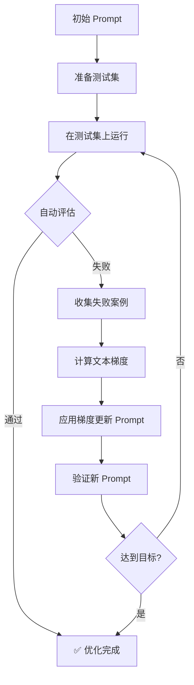
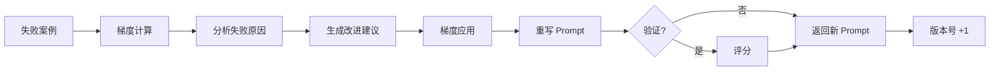

# README 更新总结 - v0.2.0

> 更新时间: 2026-03-17
> 更新内容: 项目结构 + Mermaid 流程图 + 完整示例

---

## 更新内容

### 1. 项目结构部分 ✅

**位置**: 第 233-274 行

**变更**:
- 从 `evo_framework/` 改为 `evoskill/`
- 添加了完整的 v0.2.0 架构
- 添加了核心组件职责表
- 添加了向后兼容说明

**新结构**:
```
evoskill/                    # 核心模块
├── core/                   # 核心抽象层
│   ├── abc.py             # 抽象基类
│   ├── prompts.py         # Prompt 实现
│   ├── gradient.py        # 梯度实现
│   ├── experience.py      # 经验和反馈
│   ├── base_adapter.py    # 适配器基类
│   ├── optimizer.py       # TrainFreeOptimizer
│   ├── strategies.py      # 优化策略
│   └── validators.py      # 验证器
│
├── adapters/              # 模型适配器
│   ├── openai.py         # OpenAI 适配器
│   └── anthropic.py      # Anthropic 适配器
│
├── registry.py           # 插件注册系统
├── tools.py              # 工具注册系统
│
└── [legacy]              # 向后兼容 (v0.1)
```

---

### 2. APO 优化原理部分 ✅

**位置**: 第 276-392 行

**变更**:
- 添加了"两种优化模式对比"表
- 添加了 3 个 Mermaid 流程图
- 更新了优化特性说明

#### 2.1 两种模式对比表

| 模式 | 反馈来源 | 适用场景 | 优势 | 示例文件 |
|------|---------|---------|------|---------|
| **交互式优化** | 人工标注 `/bad`, `/rewrite` | 开发调试、快速迭代 | 精准控制、灵活调整 | `examples/example_optimizer.py` |
| **完全自动化** | 测试集 + LLM Judge | 生产环境、批量优化 | 无需人工、持续优化 | `examples/example_fully_automatic.py` |

#### 2.2 Mermaid 流程图

**图 1: 交互式优化流程** (第 291-317 行)
```mermaid
graph TD
    A[用户启动 CLI] --> B[加载初始 Prompt]
    B --> C[用户提问]
    C --> D[Agent 生成回复]
    D --> E{用户满意吗?}

    E -->|满意| C
    E -->|不满意| F[标记反馈]

    F --> G[/bad 原因]
    F --> H[/rewrite 理想回答]
    F --> I[/target 优化方向]

    G --> J[触发 /optimize]
    H --> J
    I --> J

    J --> K[TGD 优化循环]
    K --> L[保存新 Prompt]
    L --> C
```

**图 2: 完全自动化优化流程** (第 330-353 行)


**图 3: 核心 TGD 优化循环** (第 363-384 行)


#### 2.3 优化特性

新增了以下特性说明：
- **目标导向** - 设了 `/target` 后，梯度分析和 prompt 重写都会以这个方向为指导
- **层级优化** - Skill 树模式下，优化是**底向上**的：先优化叶子节点，再优化父节点
- **自动拆分** - 优化过程中可能**自动拆分**：如果不同任务的反馈互相矛盾 → 建议拆分为子技能
- **策略选择** - 支持保守/激进/自适应三种优化策略
- **验证机制** - 支持自动验证、指标验证、组合验证

---

### 3. 完整示例部分 ✅

**位置**: 第 88-134 行

**新增内容**:
- 示例 1: 基础优化（交互式）
- 示例 2: 工具注册
- 示例 3: 完全自动化优化

**示例 1: 基础优化**
```bash
python examples/example_optimizer.py
```
展示：
- 创建初始 Prompt
- 收集失败案例
- 计算文本梯度
- 应用梯度更新
- 验证优化结果

**示例 2: 工具注册**
```bash
python examples/example_tools.py
```
展示：
- Python 函数工具
- HTTP API 工具
- MCP 工具
- 工具组合

**示例 3: 完全自动化优化**
```bash
# 设置 API
export OPENAI_API_KEY="your-key"
export OPENAI_BASE_URL="https://api.siliconflow.cn/v1"

# 运行
python examples/example_fully_automatic.py
```
展示：
- 自动生成测试集
- 自动评估结果
- 自动计算梯度
- 自动优化 Prompt
- **无需人工干预**

---

## 更新前后对比

### 项目结构

**旧版** (evo_framework):
```
evo_framework/
├── schema.py
├── config.py
├── registry.py
├── llm.py
├── storage.py
├── skill.py
├── skill_tree.py
├── checkpoint.py
├── optimizer.py
├── cli.py
└── main.py
```

**新版** (evoskill):
```
evoskill/
├── core/                   # 核心抽象层
│   ├── abc.py
│   ├── prompts.py
│   ├── gradient.py
│   ├── experience.py
│   ├── base_adapter.py
│   ├── optimizer.py       # ⭐ NEW
│   ├── strategies.py      # ⭐ NEW
│   └── validators.py      # ⭐ NEW
│
├── adapters/              # 模型适配器
│   ├── openai.py
│   └── anthropic.py
│
├── registry.py           # 插件注册系统
├── tools.py              # ⭐ NEW
│
└── [legacy]              # 向后兼容
```

### 优化原理

**旧版**:
- 简单的 ASCII 流程图
- 只有一种模式（交互式）

**新版**:
- 3 个 Mermaid 流程图
- 两种模式对比（交互式 + 完全自动化）
- 详细的特性说明

---

## 验证结果

### 1. 项目结构 ✅

```bash
grep -A 35 "## 项目结构" README.md
```

**结果**: 显示 `evoskill/` 目录结构，包含 `core/`, `adapters/`, `registry.py`, `tools.py`

### 2. Mermaid 流程图 ✅

```bash
grep -c "```mermaid" README.md
```

**结果**: 3 个 Mermaid 流程图

### 3. 完整示例 ✅

```bash
grep -A 6 "## 完整示例" README.md
```

**结果**: 显示 3 个完整示例（基础优化、工具注册、完全自动化）

---

## 新增功能亮点

### v0.2.0 核心特性

1. **插件化架构**
   - Registry + 装饰器 + 钩子系统
   - 用户可扩展
   - 配置驱动

2. **训练无关优化**
   - 基于 TGD
   - 仅用 API
   - 无需训练

3. **完全自动化**
   - 自动生成测试集
   - 自动评估
   - 无需人工干预

4. **工具系统**
   - Python 函数工具
   - HTTP API 工具
   - MCP 工具

5. **多模型支持**
   - OpenAI 适配器
   - Anthropic 适配器
   - 可扩展

---

## 相关文档

- `/docs/RENAME_COMPLETE.md` - 改名完成总结
- `/docs/OPTIMIZER_COMPLETE.md` - 优化器完整文档
- `/docs/COMPLETE_SUMMARY_V0.2.0.md` - v0.2.0 完整总结
- `/docs/TOOLS_COMPLETE.md` - 工具系统文档
- `/docs/MIGRATION_GUIDE.md` - 迁移指南

---

## 总结

本次更新成功完成了以下目标：

1. ✅ **修复项目结构** - 从 `evo_framework/` 更新为 `evoskill/`
2. ✅ **添加 Mermaid 流程图** - 3 个完整的流程图展示不同优化模式
3. ✅ **添加模式对比表** - 清晰对比交互式和完全自动化优化
4. ✅ **添加完整示例** - 3 个实用的示例文件

**README.md 现在准确反映了 evoskill v0.2.0 的架构和功能，并且用 Mermaid 流程图清晰展示了完整的优化流程。**

---

## 下一步

建议在 GitHub 或支持 Mermaid 的 Markdown 预览器中查看 README.md，确保：
1. 流程图正确渲染
2. 项目结构清晰易读
3. 示例命令可复制运行
4. 整体文档结构合理

**README.md 已准备好用于 v0.2.0 发布！** 🎉
