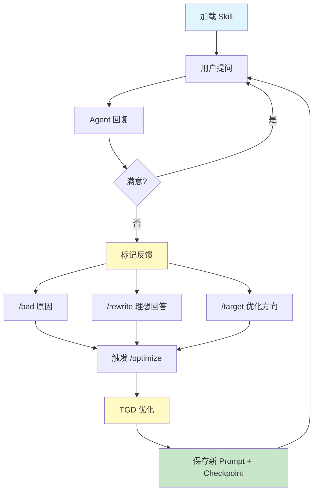
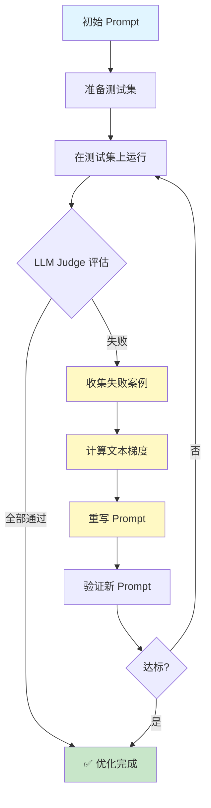
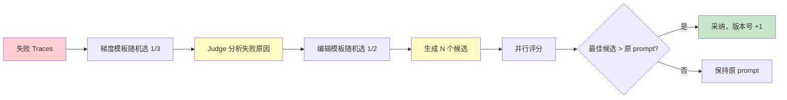
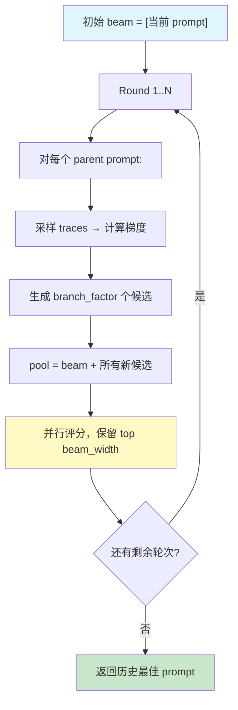
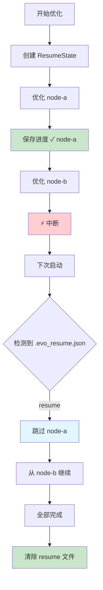

# APO 自动提示优化原理

evoskill 的核心是 **APO（Automatic Prompt Optimization）**——把 System Prompt 当作"权重"，通过文本梯度下降（TGD）让 prompt 自动进化。

## 两种优化模式

| 模式 | 反馈来源 | 适用场景 | 示例 |
|------|---------|---------|------|
| **交互式** | 人工 `/bad`、`/rewrite` | 开发调试、快速迭代 | `examples/example_optimizer.py` |
| **全自动** | 测试集 + LLM Judge | 生产环境、批量优化 | `examples/example_fully_automatic.py` |

---

## 模式 1：交互式优化

用户在 CLI 中与 Agent 对话，标记不满意的回复，触发优化。

**步骤**：
1. **收集反馈** — `/bad`、`/rewrite` 标记不满意的交互
2. **诊断失败** — 筛选低分 Trace
3. **计算梯度** — Judge 模型分析 prompt 为何导致失败
4. **重写 Prompt** — Judge 模型据此改写 System Prompt
5. **保存** — 版本号 +1，写入 SKILL.md + 保存 checkpoint

---

## 模式 2：全自动优化

基于测试集和 LLM Judge，无需人工干预，适合生产环境持续优化。

---

## 核心 APO 循环（Beam Search）

无论哪种模式，内部都走 APO 引擎（对齐 Agent-Lightning）。支持两种搜索策略：

### 单轨模式（beam_width=1，默认）

### Beam Search 模式（beam_width>1）

**核心思想**：
- 失败案例 = 训练信号
- 文本梯度 = 自然语言的失败分析（3 种模板随机选择增加多样性）
- 编辑策略 = 激进重写 / 保守单点修复（2 种模板随机选择）
- Beam Search = 保留 top-k prompt 跨轮优化，避免局部最优
- 免训练，仅靠 API 调用

---

## 断点续跑

优化过程支持中断恢复。每个节点优化完成后自动保存进度到 `.evo_resume.json`，中断后下次启动可从断点继续。

---

## 优化特性

| 特性 | 说明 |
|------|------|
| 目标导向 | `/target` 设置方向后，梯度分析和重写都以此为指导 |
| 层级优化 | Skill 树模式下 bottom-up：先叶子后父节点 |
| 自动拆分 | 反馈互相矛盾时建议拆分为子技能 |
| 自动剪枝 | 低性能子节点自动移除 |
| 策略选择 | 保守 / 激进 / 自适应三种策略 |
| 部分优化 | 可只优化 prompt 的指令、示例、或约束部分 |
| Beam Search | beam_width>1 时保留多个候选跨轮优化 |
| 节点级路由 | Trace.node_path 让每个节点只用属于自己的数据优化 |
| 断点续跑 | 中断后可从上次进度恢复 |
