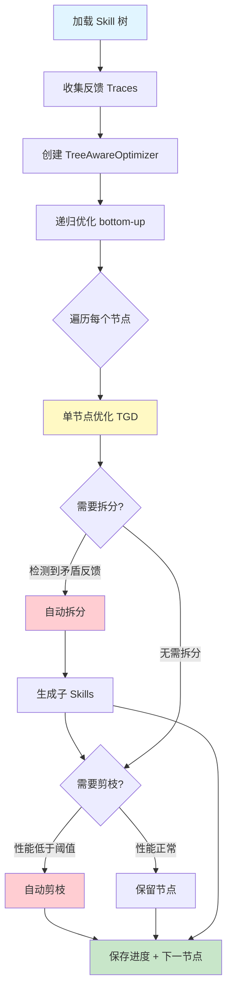
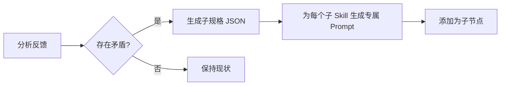
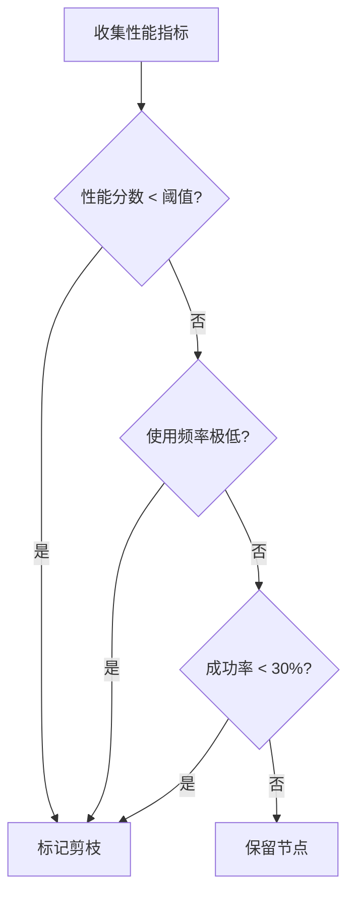

# 树感知优化原理

evoskill 支持将 Skill 组织为树形层级，并对整棵树进行递归优化。

## Skill 树结构

```
my-skills/
├── SKILL.md              # 根技能（通用写作）
├── social/
│   ├── SKILL.md          # 社交类子技能
│   ├── moments/
│   │   └── SKILL.md      # 朋友圈专精
│   └── weibo/
│       └── SKILL.md      # 微博专精
└── business/
    ├── SKILL.md           # 商务类子技能
    ├── email/
    │   └── SKILL.md
    └── product/
        └── SKILL.md
```

每个目录包含一个 `SKILL.md`（遵循 [Agent Skills 标准](https://agentskills.io/specification)），可选 `config.yaml`。

---

## 树优化主流程

TreeAwareOptimizer 采用 **bottom-up** 策略：先优化叶子节点，再优化父节点。



---

## 自动拆分

当一个 Skill 收到的反馈覆盖不同领域且互相矛盾时，框架建议将其拆分为多个子 Skill。



**触发条件**：同一个 Skill 的反馈在风格、领域、目标上出现明显分歧。

**示例**：写作助手同时收到"商务邮件太随意"和"朋友圈文案太正式"的反馈 → 拆分为 `business` 和 `social` 两个子 Skill。

---

## 自动剪枝

优化过程中，性能持续低下的子节点会被自动移除，其职责回归父节点。



---

## 部分优化

可以只优化 prompt 的特定部分，而非全部重写：

| 策略 | 说明 |
|------|------|
| `all` | 完整优化（默认） |
| `instruction` | 只优化指令部分 |
| `examples` | 只优化 few-shot 示例 |
| `constraints` | 只优化约束条件 |

---

## 使用示例

```python
from evoskill import (
    SkillTree,
    OpenAIAdapter,
    TreeAwareOptimizer,
    TreeOptimizerConfig,
)

# 配置
adapter = OpenAIAdapter(model="gpt-4o-mini")
config = TreeOptimizerConfig(
    auto_split=True,
    auto_prune=True,
    prune_threshold=0.3,
    section="all",
)
optimizer = TreeAwareOptimizer(adapter=adapter, config=config)

# 加载 → 优化 → 保存
tree = SkillTree.load("my-skills/")
experiences = load_experiences("traces.jsonl")
result = optimizer.optimize_tree(tree, experiences)

print(f"优化 {result.nodes_optimized} 个节点")
print(f"拆分 {result.splits_performed} 次")
print(f"剪枝 {result.prunes_performed} 个节点")

result.tree.save("my-skills-optimized/")
```
